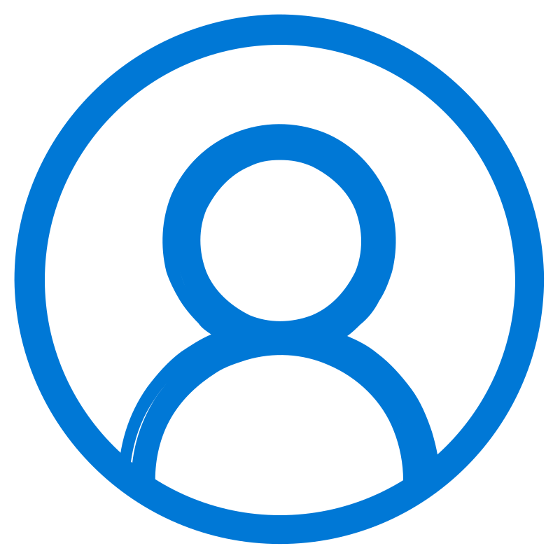

# People

## Lab Director

:material-account-tie: __Dr. Morteza Zakeri__  
{ width="175" align=right loading=lazy .circle-image}  
 
**Ph.D. in Computer Engineering**
 
**Software and AI**
 
 
[:material-web:](https://www.m-zakeri.ir/){target="_blank"}  | [:fontawesome-brands-google-scholar:](https://scholar.google.com/citations?user=km5DzwwAAAAJ&hl=en){target="_blank"} | [:simple-researchgate:](https://www.researchgate.net/profile/Morteza-Zakeri){target="_blank"} | [:fontawesome-brands-linkedin-in:](https://www.linkedin.com/in/mortazazakeri/){target="_blank"}  
{ .card }

## PhD Students

<!-- Card 1 -->
:material-account-tie: __Full Name__  
{ width="150" align=right loading=lazy }  
   
- Major:  
**Computer Engineering**  
   
- Specialization:  
**Software**  
   
- Research Areas:  
**Software Testing, Deep Learning, Software Security**  
 
 
[:fontawesome-brands-google-scholar:](#) | [:simple-researchgate:](#) | [:fontawesome-brands-linkedin-in:](#)
{ .card }

<!-- Card 2 -->
:material-account-tie: __Full Name__  
{ width="150" align=right loading=lazy }  
 
Major:  
**Computer Engineering**  
 
Specialization:  
**Software**  
 
Research Areas:  
**Software Testing, Deep Learning, Software Security**  
 
 
[:fontawesome-brands-google-scholar:](#) | [:simple-researchgate:](#) | [:fontawesome-brands-linkedin-in:](#)
{ .card }

## M.Sc. Students

<!-- Card 1 -->
:material-account-tie: __Full Name__  
{ width="150" align=right loading=lazy }  
   
- Major:  
**Computer Engineering**  
 
- Specialization:  
**Software**  
 
- Research Areas:  
**Software Testing, Deep Learning, Software Security**  
 
 
[:fontawesome-brands-google-scholar:](#) | [:simple-researchgate:](#) | [:fontawesome-brands-linkedin-in:](#)
{ .card }

<!-- Card 2 -->
:material-account-tie: __Full Name__  
{ width="150" align=right loading=lazy }  
   
Major:  
**Computer Engineering**  
   
Specialization:  
**Software**  
   
Research Areas:  
**Software Testing, Deep Learning, Software Security**  
   
   
[:fontawesome-brands-google-scholar:](#) | [:simple-researchgate:](#) | [:fontawesome-brands-linkedin-in:](#)
{ .card }

## B.Sc. Students

## Alumni

