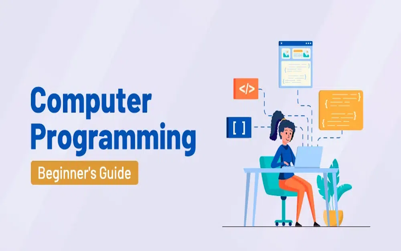
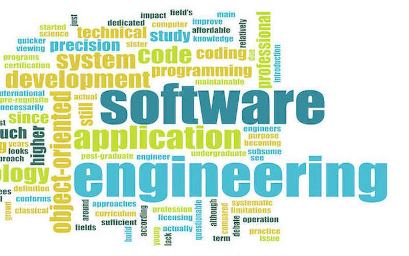
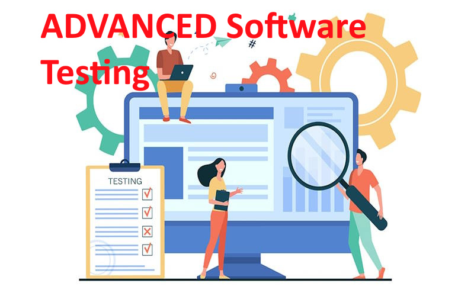

# دروس و دوره‌های آموزشی

آزمایشگاه مهندسی نرم‌افزار هوشمند طیف متنوعی از موضوعات علم و مهندسی کامپیوتر را در قالب‌ دروس دانشگاهی، آموزش‌های آزاد و کارگاه‌ها ارائه می‌دهد. 
هدف اصلی از این آموزش‌ها توانایی درک و حل مسائل دنیای واقعی با راهکارهای نرم‌افزاری و هوشمند است. 

## دوره‌های کارشناسی 

<!-- Compiler -->

|                                                                                                                                   **مهندسی کامپایلر**                                                                                                                                   |
|:---------------------------------------------------------------------------------------------------------------------------------------------------------------------------------------------------------------------------------------------------------------------------------------:|
|                                                                                               { width="350" alt="Compiler Design" loading=lazy}                                                                                               |
|                                                                                                                       کارشناسی  **مهندسی کامپیوتر**  - نرم افزار                                                                                                                        |
| کامپایلرها از مهمترین نرم افزارهای سیستمی موجود هستند. توسط آنها پیاده سازی زبانهای برنامه نویسی محقق می شود. افزون بر آنها، کاربردهایی در تحلیل برنامه، آزمون نرم‌افزار، بازآرایی نرم‌افزار و امنیت دارند. در این درس به اصول، فنون و ابزارهای طراحی و ساخت کامپایلرها پرداخته می‌شود. |
|                                [:technologist_tone1: سایت درس ](https://m-zakeri.github.io/Compilers){target="_blank" .md-button .md-button--primary }             [ :material-web: سرفصل مطالب](compiler_engineering.md){target="_blank" .md-button  }                                 |

<!-- Software Testing -->

|                                                                                                                               **آزمون نرم‌افزار**                                                                                                                               |
|:-------------------------------------------------------------------------------------------------------------------------------------------------------------------------------------------------------------------------------------------------------------------------------:|
|                                                                                         { width="350" alt="Software Testing" loading=lazy}                                                                                         |
|                                                                                                                   کارشناسی   **مهندسی کامپیوتر**  - نرم افزار                                                                                                                   |
| آزمون نرم‌افزار بخش مهمی از چرخه عمر توسعه نرم افزار است. آزمون فرآیندی است که طی آن اطمینان حاصل می‌شود که نرم‌افزاری که می‌سازیم قابل‌اعتماد، ایمن است و همانطور که در نظر گرفته شده عمل می‌کند.  در این درس به اصول، فنون، مراحل و ابزارهای آزمون نرم افزار پرداخته می شود. |
|                           [:technologist_tone1: سایت درس ](https://m-zakeri.github.io/SoftwareTesting){target="_blank" .md-button .md-button--primary }             [ :material-web: سرفصل مطالب](software_testing.md){target="_blank" .md-button  }                            |

<!-- Computer Programming -->

|                                                                                                                                **برنامه نویسی ساخت یافته در C**                                                                                                                                |
|:----------------------------------------------------------------------------------------------------------------------------------------------------------------------------------------------------------------------------------------------------------------------------------------------:|
|                                                                                                  { width="350" alt="C Programming" loading=lazy}                                                                                                  |
|                                                                                                                          کارشناسی   **مهندسی کامپیوتر**  - نرم افزار                                                                                                                           |
| زبان برنامه نویسی C یکی از پایه ای ترین و پرکاربردترین زبان های برنامه نویسی است که در ساخت سیستم عامل ها، نرم افزارهای بلادرنگ و اینترنت اشیا کاربرد دارد. بسیاری از زبانهای برنامه نویسی با کمک این زبان ایجاد شده اند. این درس اصول برنامه نویسی ساخت یافته در زبان C را آموزش داده می دهد. |
|                                           [:technologist_tone1: سایت درس ](https://m-zakeri.github.io/CP){target="_blank" .md-button .md-button--primary }             [ :material-web: سرفصل مطالب](c_programming.md){target="_blank" .md-button  }                                           |

## دوره‌های تحصیلات تکمیلی (کارشناسی ارشد و دکتری)

<!-- Advanced Software Engineering -->

|                                                                                                                **مهندسی نرم افزار پیشرفته**                                                                                                                |
|:----------------------------------------------------------------------------------------------------------------------------------------------------------------------------------------------------------------------------------------------------------:|
|                                                                         { width="350" alt="Advanced Software Engineering" loading=lazy}                                                                          |
|                                                                                                  کارشناسی ارشد و دکتری  **مهندسی کامپیوتر**  - نرم افزار                                                                                                   |
|                           هدف از این درس آشنایی دانشجویان با پارادایم‌های مختلف مورد استفاده در توسعه نرم‌افزار است که شامل متدلوژی‌های مختلف توسعه نرم‌افزار و همچنین رویکردهای مختلف به مدیریت پیچیدگی توسعه نرم‌افزار می‌شود.                           |
| [:technologist_tone1: سایت درس ](https://m-zakeri.github.io/advanced-software-engineering.html){target="_blank" .md-button .md-button--primary }             [ :material-web: سرفصل مطالب](software_engineering_advanced.md){target="_blank" .md-button  } |

<!-- Advanced Software Testing and Program Analysis -->

|                                                                                                 **آزمون و تحلیل نرم‌افزار پیشرفته**                                                                                                 |
|:-----------------------------------------------------------------------------------------------------------------------------------------------------------------------------------------------------------------------------------:|
|                                                          { width="350" alt="Advanced Software Testing" loading=lazy}                                                          |
|                                                                                      کارشناسی ارشد و دکتری   **مهندسی کامپیوتر**  - نرم افزار                                                                                       |
|            هدف این درس آشنایی دانشجویان با روش‌های نوین در آزمون و تحلیل  خودکار نرم‌افزارها از طریق تولید و تزریق  خودکار آزمایه و نحوه ارزیابی اثربخشی آزمون نرم‌افزار از طریق معیارهای پوشش کد و تحلیل موتاسیون است.             |
| [:technologist_tone1: سایت درس ](https://m-zakeri.github.io/SoftwareTesting){target="_blank" .md-button .md-button--primary }             [ :material-web: سرفصل مطالب](software_testing_advanced.md){target="_blank" .md-button  } |

<!-- Patterns in Software Engineering -->

|                                                                                                                            **اصول و الگوها در مهندسی نرم‌افزار**                                                                                                                            |
|:-------------------------------------------------------------------------------------------------------------------------------------------------------------------------------------------------------------------------------------------------------------------------------------------:|
|                                                                                       { width="350" alt="Advanced Software Testing" loading=lazy}                                                                                        |
|                                                                                                                  کارشناسی ارشد و دکتری   **مهندسی کامپیوتر**  - نرم افزار                                                                                                                   |
|  هدف این دوره، فراهم‌سازی دیدگاهی الگو-محور در مهندسی نرم‌افزار به گونه‌ای است که دانشجویان با آشنایی با الگوهای پرکاربرد در طراحی و معماری سیستم‌های نرم‌افزاری، بتوانند به تشخیص دقیق و کاربردی این الگوها دست یابند و از فنون خودکارسازی برای بهبود کیفیت و عملکرد نرم‌افزار بهره ببرند. | 
|          [:technologist_tone1: سایت درس ](https://www.m-zakeri.ir/patterns-and-principle-in-software-engineering.html){target="_blank" .md-button .md-button--primary }             [ :material-web: سرفصل مطالب](software_engineering_patterns.md){target="_blank" .md-button  }           |

## دوره‌های آزاد

برای سفارش دوره‌های آموزش آزاد و کارگاهی از طریق لینک زیر اقدام نمایید. 

[ارتباط با ما](../contact.md){target="_blank" .md-button .md-button--primary } 

### دوره‌های امنیت و تحلیل برنامه

<!--  Secure software design and development -->

|                                                                                                                                                                                                                                                                                                **طراحی و توسعه امن نرم‌افزار**                                                                                                                                                                                                                                                                                                |
|:-----------------------------------------------------------------------------------------------------------------------------------------------------------------------------------------------------------------------------------------------------------------------------------------------------------------------------------------------------------------------------------------------------------------------------------------------------------------------------------------------------------------------------------------------------------------------------------------------------------------------------:|
|                                                                                                                                                                                                                                              { width="350" alt="Secure Software Development" loading=lazy}                                                                                                                                                                                                                                               |
|                                                                                                                                                                                                                                                                                         همه مقاطع   **مهندسی کامپیوتر**  - نرم افزار                                                                                                                                                                                                                                                                                          |
| این دوره شرکت‌کنندگان را با چالش‌های اصلی در طراحی و پیاده‌سازی سیستم‌های نرم‌افزاری امن و برنامه‌های کاربردی امن آشنا می‌سازد. اهمیت امنیت، انواع آسیب‌پذیری‌های نرم‌افزار و چگونگی بهره‌بردن مهاجمان از آسیب‌پذیری‌ها از موضوعاتی هستند که در این درس مطرح می‌شوند. همچنین، دانش‌پذیران و دانش‌پژوهان می‌آموزند چگونه می‌توان به‌صورت روش‌مند با تلفیق امنیت و چرخه حیات توسعه نرم‌افزار با حمله‌ها به موقع و در هنگام طراحی و توسعه نرم‌افزار مقابله کرد. بدین منظور، لازم است که دانش‌پژوهان تحلیل نیازمندی‌های امنیتی، مدل‌سازی تهدید، مدیریت مخاطرات امنیتی، برنامه‌نویسی امن و نیز بازبینی و آزمون امنیتی را فراگیرند. | 
|                                                                                                                                                                                                          [:technologist_tone1: سفارش دوره ](../contact.md){target="_blank" .md-button .md-button--primary }             [ :material-web: سرفصل مطالب](secure_software_development.md){target="_blank" .md-button  }                                                                                                                                                                                                           |

## کارگاه‌ها 

1. کارگاه پژوهش علمی: اصول، روش‌ها و ابزارها
2. هوش مصنوعی و علم داده با پایتون

