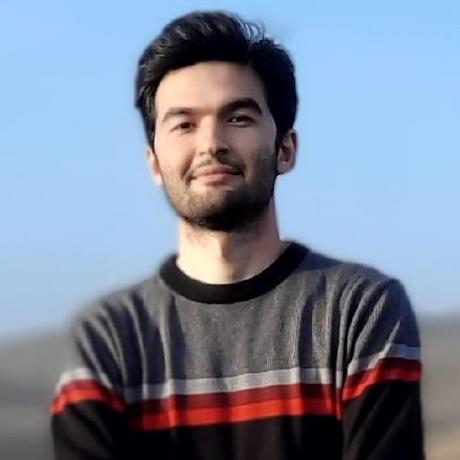
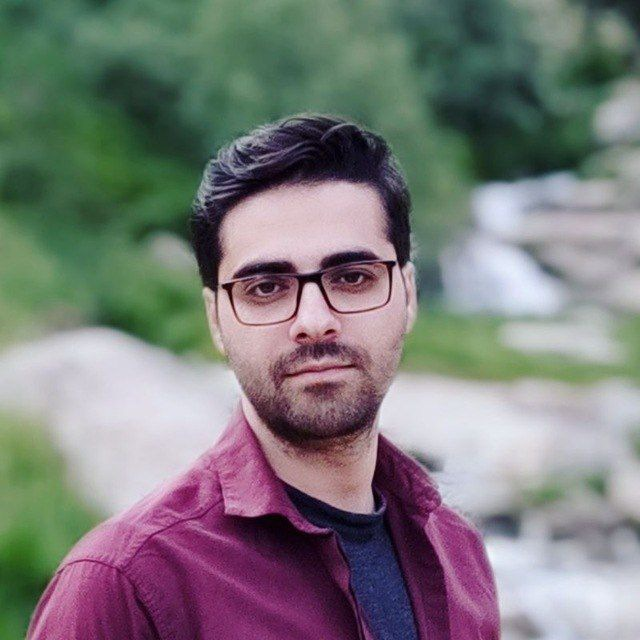

# اعضای سابق

<!-- 4 -->
:material-account-tie: رسول رضوانی جلال
{ width="150"  align=left loading=lazy}
 
رشته:
**مهندسی کامپیوتر**
 
گرایش:
**نرم افزار**
 
آخرین مقطع تحصیلی:
**کارشناسی ارشد**
 
زمینه های پژوهشی:
**امنیت نرم افزار، آزمون نرم افزار، یادگیری ماشین، تحلیل بدافزار، هوش تهدید سایبری**
 
 
[:fontawesome-brands-google-scholar:](https://scholar.google.com/citations?hl=en&user=ApwoXgUAAAAJ)
|
[:simple-researchgate:](https://www.researchgate.net/profile/Rasoul-Rezvani)
|
[:fontawesome-brands-linkedin-in:](https://www.linkedin.com/in/rasoul-rezvani-80725721a/)
{ .card }

<!-- 3 -->
:material-account-tie: مصطفی مرادی
{ width="150"  align=left loading=lazy}
 
رشته:
**مهندسی کامپیوتر**
 
گرایش:
**نرم افزار**
 
آخرین مقطع تحصیلی:
**کارشناسی ارشد**
 
زمینه های پژوهشی:
**آزمون نرم افزار، امنیت نرم افزار، پردازش زبان طبیعی، مدل های زبان بزرگ**
 
 
[:fontawesome-brands-google-scholar:](#)
|
[:simple-researchgate:](#)
|
[:fontawesome-brands-linkedin-in:](#)
{ .card }

<!-- 2 -->
:material-account-tie: __نام و نام خانوادگی__
{ width="150"  align=left loading=lazy}
 
رشته:
**مهندسی کامپیوتر**
 
گرایش:
**نرم افزار**
 
زمینه های پژوهشی:
**آزمون نرم افزار، یادگیری ژرف، امنیت نرم افزار**
 
 
[:fontawesome-brands-google-scholar:](#)
|
[:simple-researchgate:](#)
|
[:fontawesome-brands-linkedin-in:](#)
{ .card }

<!-- 1 -->
:material-account-tie: __نام و نام خانوادگی__
{ width="150"  align=left loading=lazy}
 
رشته:
**مهندسی کامپیوتر**
 
گرایش:
**نرم افزار**
 
زمینه های پژوهشی:
**آزمون نرم افزار، یادگیری ژرف، امنیت نرم افزار**
 
 
[:fontawesome-brands-google-scholar:](#)
|
[:simple-researchgate:](#)
|
[:fontawesome-brands-linkedin-in:](#)
{ .card }

