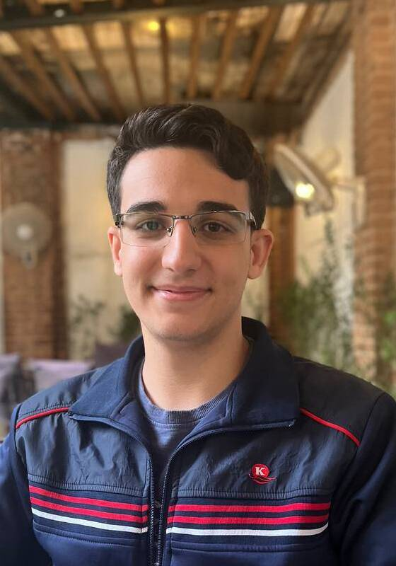
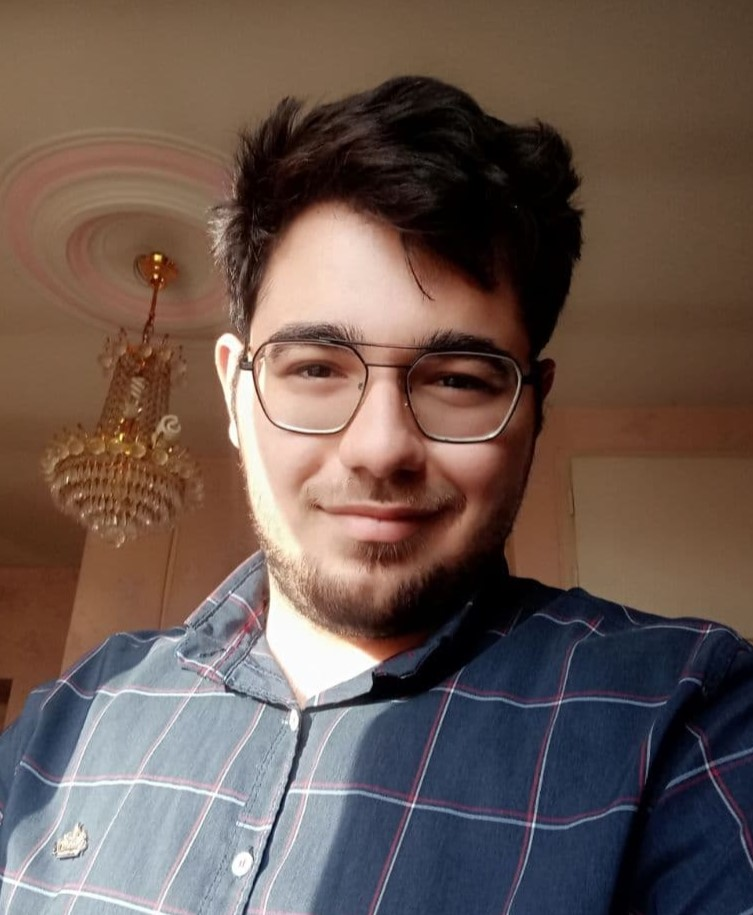

# دانشجویان کارشناسی

<!-- 1 -->
:material-account-tie: __علیرضا پاکساز__
{ width="150"  align=left loading=lazy}
 
رشته:
**مهندسی کامپیوتر**
 
گرایش:
**نرم افزار**
 
زمینه های پژوهشی:
**بازی، توسعه بازی، مدل های زبانی بزرگ**
 
 
[:fontawesome-brands-google-scholar:](#)
|
[:simple-researchgate:](#)
|
[:fontawesome-brands-linkedin-in:](https://www.linkedin.com/in/alireza-paksaz/)
{ .card }

<!-- 2 -->
:material-account-tie: __حسین اسدی__
{ width="120"  align=left loading=lazy align=left}
 
رشته:
**مهندسی کامپیوتر**
 
گرایش:
**نرم افزار**
 
زمینه های پژوهشی:
**کامپایلر**
 
 
[:fontawesome-brands-linkedin-in:](https://www.linkedin.com/in/hossein-asadi0109/)
{ .card }

<!-- 3 -->
:material-account-tie: __حامد فلاحی__
{ width="120" align=left loading=lazy }
 
رشته:
**مهندسی کامپیوتر**
 
گرایش:
**نرم افزار**
 
زمینه های پژوهشی:
**آزمون نرم‌افزار ،یادگیری ماشین، کامپایلر**
 
{ .card }

