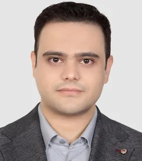

# افراد 

## راهبر آزمایشگاه

:material-account-tie: __دکتر مرتضی ذاکری__
{ width="150"  align=left loading=lazy .circle-image}
 
**دکتری مهندسی کامپیوتر**
 
**گرایش نرم افزار**
 
 
[:material-web:](https://www.m-zakeri.ir/){target="_blank"}
|
[:fontawesome-brands-google-scholar:](https://scholar.google.com/citations?user=km5DzwwAAAAJ&hl=en){target="_blank"}
|
[:simple-researchgate:](https://www.researchgate.net/profile/Morteza-Zakeri){target="_blank"}
|
[:fontawesome-brands-linkedin-in:](https://www.linkedin.com/in/mortazazakeri/){target="_blank"}
{ .card }

## عضویت
**آزمایشگاه مهندسی نرم‌افزار هوشمند** میزبان دانشجویان و محققان علاقه‌مند به تحقیق و توسعه در حوزه **مهندسی نرم‌افزار** است. این آزمایشگاه به عنوان فضایی پویا و تخصصی، امکان مشارکت در پروژه‌های پژوهشی و صنعتی را برای محققان فراهم می‌کند.  

### 👥 چه کسانی می‌توانند در آزمایشگاه فعالیت کنند؟  
✅ **دانشجویان دکتری و کارشناسی ارشد** که در حال انجام پژوهش‌های تخصصی هستند.  
✅ **دانشجویان کارشناسی** که علاقه‌مند به یادگیری عملی و توسعه نرم‌افزارهای کاربردی‌اند.  
✅ **محققان مستقل** که به دنبال حل چالش‌های نوین در زمینه مهندسی نرم‌افزار هستند.  

🌱 **آزمایشگاه مهندسی نرم‌افزار هوشمند، محیطی مناسب برای پژوهش، همکاری علمی و توسعه فناوری‌های نوین است.** اگر علاقه‌مند به فعالیت در این حوزه هستید، به ما بپیوندید!  
